# User Usage Workflows — One Flow per Screen

Every screen of My Budget as a picture. Read left to right (or top to bottom). Dotted line = optional link, diamond = a choice.

**Legend**

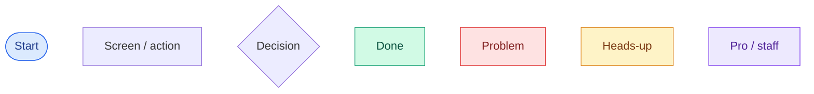

**Screens:** [App map](#map) · [Login](#login) · [Register](#register) · [Forgot password](#forgot) · [Reset password](#reset) · [Confirm email](#verify) · [Dashboard](#dashboard) · [Quick add](#quickadd) · [Input expenses](#input) · [Transactions](#transactions) · [Loans](#loans) · [People](#people) · [Person](#person) · [Investments](#investments) · [Goals](#goals) · [Accounts](#accounts) · [Budgets](#budgets) · [Free-money day](#freemoney) · [Reports](#reports) · [Settings](#settings) · [Report issue](#issue) · [Admin: Users](#users) · [Admin: Audit log](#audit) · [Admin: System metrics](#metrics)

Words are kept to a minimum on purpose. Full explanations are in [USER_MANUAL.md](USER_MANUAL.md); the screen files are listed in [README.md](README.md) §5.

---

## Map

<a id="map"></a>

### App map

`all screens` · Everyone

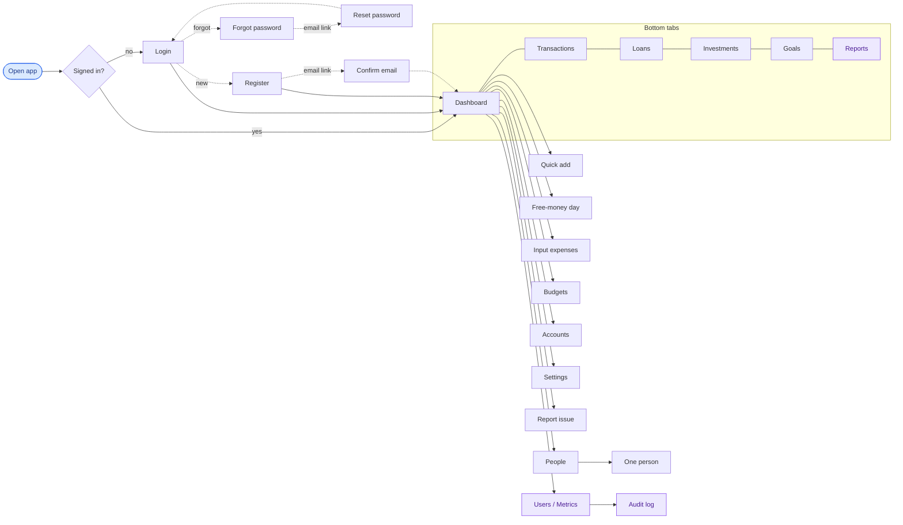

## Sign in and email links

<a id="login"></a>

### Login

`/login` · Everyone · `app/login.tsx`

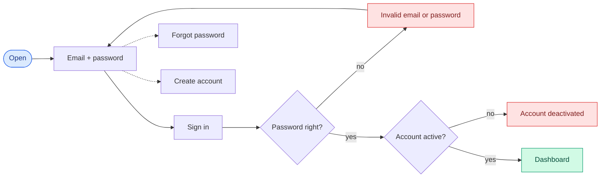

<a id="register"></a>

### Register

`/register` · Everyone · `app/register.tsx`

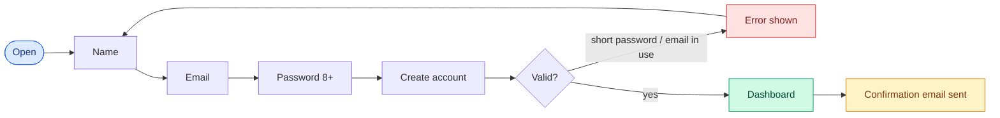

<a id="forgot"></a>

### Forgot password

`/forgot-password` · Everyone · `app/forgot-password.tsx`

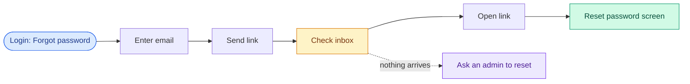

<a id="reset"></a>

### Reset password

`/reset-password?token=` · Email link · `app/reset-password.tsx`

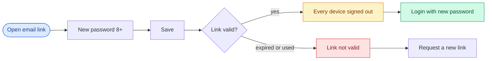

<a id="verify"></a>

### Confirm email

`/verify-email?token=` · Email link · `app/verify-email.tsx`

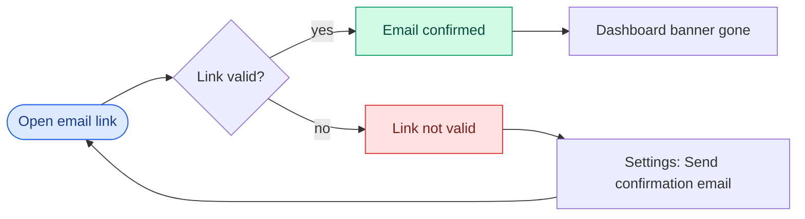

## Everyday screens

<a id="dashboard"></a>

### Dashboard

`/(tabs)` · Signed in · `app/(tabs)/index.tsx`

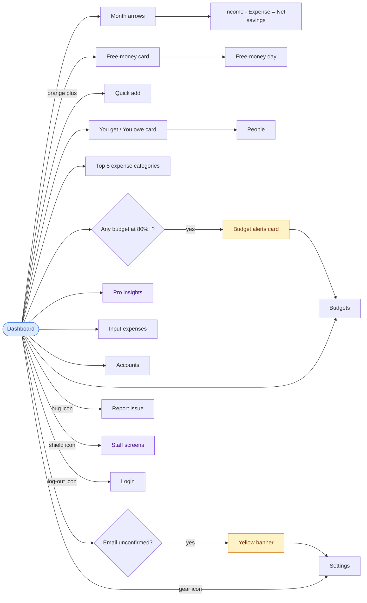

<a id="quickadd"></a>

### Quick add

`sheet on /(tabs)` · Signed in · `components/QuickAddSheet.tsx`

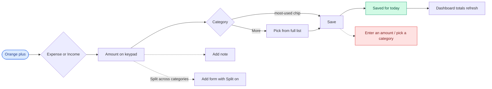

<a id="input"></a>

### Input expenses

`/input-expenses` · Signed in · `app/input-expenses.tsx`

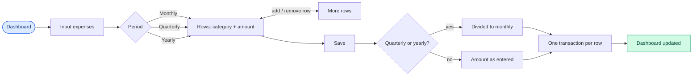

## Money tracking

<a id="transactions"></a>

### Transactions

`/(tabs)/transactions` · Signed in · `app/(tabs)/transactions.tsx`

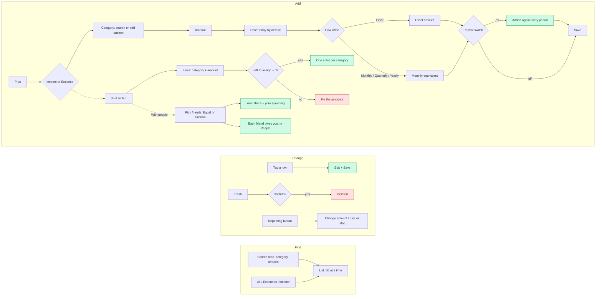

<a id="loans"></a>

### Loans

`/(tabs)/loans` · Signed in; planner is Pro · `app/(tabs)/loans.tsx`

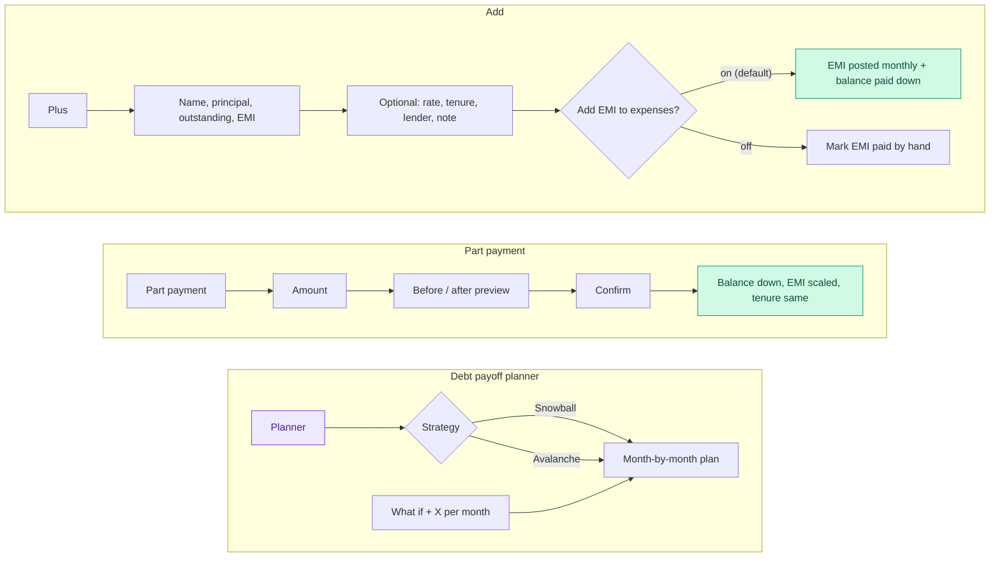

<a id="people"></a>

### People

`/people` · Signed in · `app/people/index.tsx`

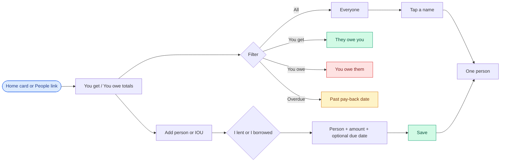

<a id="person"></a>

### Person

`/people/[id]` · Signed in · `app/people/[id].tsx`

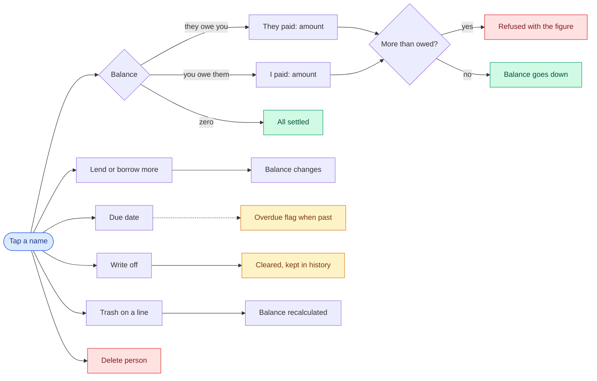

<a id="investments"></a>

### Investments

`/(tabs)/investments` · Signed in · `app/(tabs)/investments.tsx`

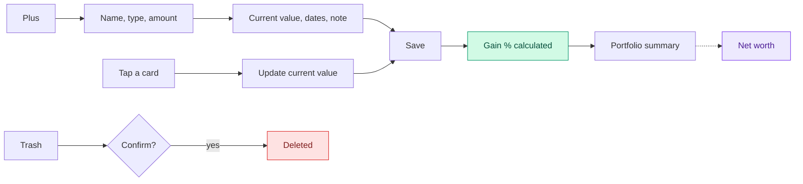

<a id="goals"></a>

### Goals

`/(tabs)/goals` · Signed in; ETA is Pro · `app/(tabs)/goals.tsx`

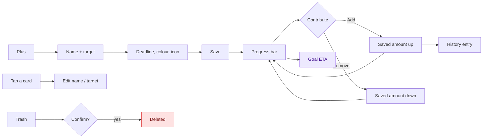

<a id="accounts"></a>

### Accounts

`/accounts` · Signed in · `app/accounts.tsx`

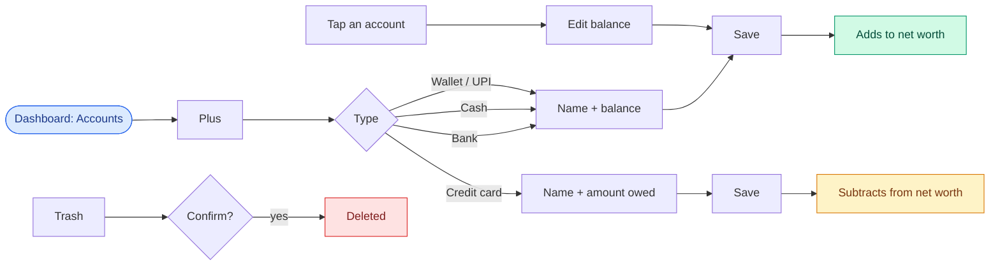

## Insight and limits

<a id="budgets"></a>

### Budgets

`/budgets` · Signed in · `app/budgets.tsx`

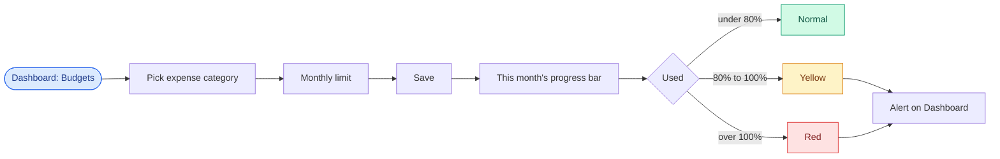

<a id="freemoney"></a>

### Free-money day

`/free-money-day` · Signed in · `app/free-money-day.tsx`

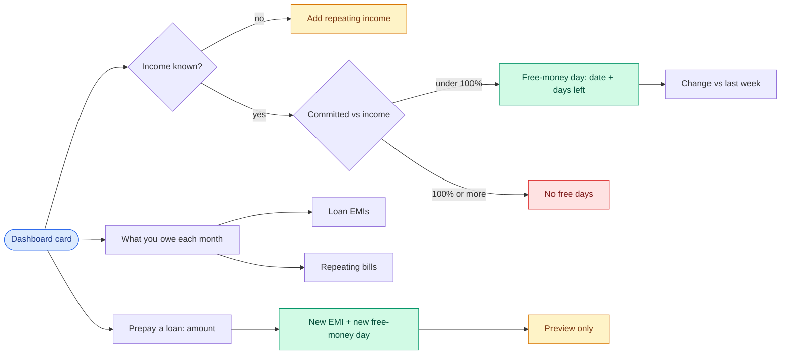

<a id="reports"></a>

### Reports

`/(tabs)/reports` · Pro · `app/(tabs)/reports.tsx`

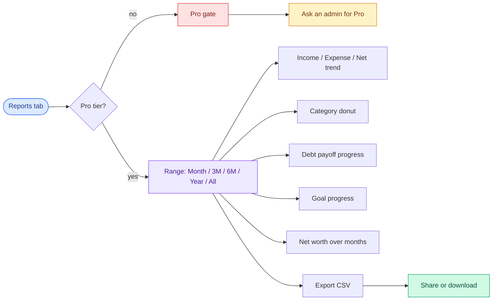

## Your account

<a id="settings"></a>

### Settings

`/settings` · Signed in · `app/settings.tsx`

```mermaid
flowchart LR
  S(["Settings"]):::entry
  S --> A["Send confirmation email"] --> A2["Link in inbox"]
  S --> B["Change password"] --> B1["Current + new 8+"] --> B2["Other devices signed out"]:::warn
  S --> C["Download my data"] --> C1["One file saved"]:::ok
  S --> D["Sign out everywhere"] --> D1{"Confirm?"} -->|yes| D2["Every device signed out"]:::warn --> LO["Login"]
  S --> E["Delete my account"] --> E1["Enter password"] --> E2{"Confirm?"} -->|yes| E3["Account + data gone"]:::bad --> LO
  classDef entry fill:#dbeafe,stroke:#2563eb,color:#1e3a8a
  classDef ok fill:#d1fae5,stroke:#059669,color:#064e3b
  classDef bad fill:#fee2e2,stroke:#dc2626,color:#7f1d1d
  classDef pro fill:#ede9fe,stroke:#7c3aed,color:#4c1d95
  classDef warn fill:#fef3c7,stroke:#d97706,color:#78350f
```

<a id="issue"></a>

### Report issue

`/report-issue` · Signed in · `app/report-issue.tsx`

```mermaid
flowchart LR
  A(["Bug icon"]):::entry --> B["Category"] --> C["Screen"] --> D["Severity"] --> E["Title + description"] --> F["Steps, expected (optional)"] --> G{"Screenshot?"}
  G -->|"yes, max 2 MB"| H["Attach"] --> I["Send"]
  G -->|no| I
  I --> J["Listed below: new"] --> K["triaged"] --> L["resolved"]:::ok
  K --> M["won't fix"]
  classDef entry fill:#dbeafe,stroke:#2563eb,color:#1e3a8a
  classDef ok fill:#d1fae5,stroke:#059669,color:#064e3b
  classDef bad fill:#fee2e2,stroke:#dc2626,color:#7f1d1d
  classDef pro fill:#ede9fe,stroke:#7c3aed,color:#4c1d95
  classDef warn fill:#fef3c7,stroke:#d97706,color:#78350f
```

## Staff only

<a id="users"></a>

### Admin: Users

`/admin` · Admin, Support · `app/admin/index.tsx`

```mermaid
flowchart LR
  A(["Shield icon"]):::pro --> B{"Role"}
  B -->|"Admin / Support"| C["Users list"]
  B -->|"System manager"| M["System metrics"]:::pro
  C --> S["Search name or email"] --> C
  C --> T["Tap a user"] --> U{"Which user?"}
  U -->|"yourself"| V["Blocked: use your own Settings"]:::bad
  U -->|"someone else"| W["Details sheet"]
  W --> X["Active switch: admin + support"]
  W --> Y["Role: admin only"]:::pro
  W --> Z["Tier: admin only"]:::pro
  W --> D["Delete: admin only"]:::bad --> D1{"Confirm?"} -->|yes| D2["Account + data deleted"]:::bad
  X --> L["Audit log entry"]:::ok
  Y --> L
  Z --> L
  D2 --> L
  classDef entry fill:#dbeafe,stroke:#2563eb,color:#1e3a8a
  classDef ok fill:#d1fae5,stroke:#059669,color:#064e3b
  classDef bad fill:#fee2e2,stroke:#dc2626,color:#7f1d1d
  classDef pro fill:#ede9fe,stroke:#7c3aed,color:#4c1d95
  classDef warn fill:#fef3c7,stroke:#d97706,color:#78350f
```

<a id="audit"></a>

### Admin: Audit log

`/admin/audit-log` · Admin · `app/admin/audit-log.tsx`

```mermaid
flowchart LR
  E["Role / tier / active / delete change"] --> L["Audit log"]:::ok
  A(["Users: document icon"]):::pro --> V["Latest 100 entries"]
  L --> V --> R["Who  |  What  |  Whom  |  Details"]
  classDef entry fill:#dbeafe,stroke:#2563eb,color:#1e3a8a
  classDef ok fill:#d1fae5,stroke:#059669,color:#064e3b
  classDef bad fill:#fee2e2,stroke:#dc2626,color:#7f1d1d
  classDef pro fill:#ede9fe,stroke:#7c3aed,color:#4c1d95
  classDef warn fill:#fef3c7,stroke:#d97706,color:#78350f
```

<a id="metrics"></a>

### Admin: System metrics

`/admin/metrics` · Admin, System manager · `app/admin/metrics.tsx`

```mermaid
flowchart LR
  A(["Shield: system manager"]):::pro --> M["System metrics"]
  B["Users screen: admin"] --> M
  M --> U["Users: active / inactive"]
  M --> S["Signups + logins"]
  M --> N["Usage counts"]
  M --> C["Cost / revenue estimate"]
  M --> X["Read only: no names, no actions"]:::warn
  classDef entry fill:#dbeafe,stroke:#2563eb,color:#1e3a8a
  classDef ok fill:#d1fae5,stroke:#059669,color:#064e3b
  classDef bad fill:#fee2e2,stroke:#dc2626,color:#7f1d1d
  classDef pro fill:#ede9fe,stroke:#7c3aed,color:#4c1d95
  classDef warn fill:#fef3c7,stroke:#d97706,color:#78350f
```
